# Kutira Kone

Kutira Kone is an AI-powered Android application designed to connect customers, vendors, and tailors through a smart fabric marketplace platform.

The app enables users to explore fabrics, receive AI-based recommendations, manage orders, and interact with vendors using a modern Android experience built with Jetpack Compose and Firebase.

---

## Problem Statement

Traditional fabric purchasing and tailoring processes lack digital connectivity between customers, vendors, and tailors. Customers often struggle to discover nearby fabric stores, compare products, and receive personalized recommendations.

Kutira Kone solves this problem through an AI-powered Android marketplace platform that connects customers and vendors with smart recommendations, real-time order management, and location-based services.

---

## Architecture

The application follows MVVM (Model-View-ViewModel) Architecture using:

- Jetpack Compose for UI
- ViewModel for state management
- Repository Pattern for data handling
- Firebase Firestore & Storage as backend
- Hilt for Dependency Injection
- Coroutines for asynchronous operations

---

# Features

- User Authentication using Firebase
- Customer & Vendor Roles
- AI-based Fabric Recommendations
- Fabric Marketplace
- Order Management
- Wishlist / Favorites
- Google Maps Integration
- Razorpay Payment Integration
- Camera & Image Upload Support
- Real-time Firebase Database
- Modern Jetpack Compose UI

---

# Tech Stack

- Kotlin
- Jetpack Compose
- Firebase Authentication
- Firebase Firestore
- Firebase Storage
- Hilt Dependency Injection
- MVVM Architecture
- Coroutines
- Google Maps API
- Gemini AI API
- Razorpay SDK

---

# Demo Login Credentials

## Test Phone Numbers

| Role | Phone Number | OTP |
|------|---------------|-----|
| Customer | +911234567890 | 223344 |
| Vendor | +919876543210 | 443322 |

> These credentials are provided only for testing/demo purposes.

---

# Installation

1. Clone the repository
2. Open the project in Android Studio
3. Add your API keys in `local.properties`

```properties
GEMINI_API_KEY=your_key_here
MAPS_API_KEY=your_key_here
```

---

## Screenshots

| Role Selection | Marketplace |
|---|---|
| 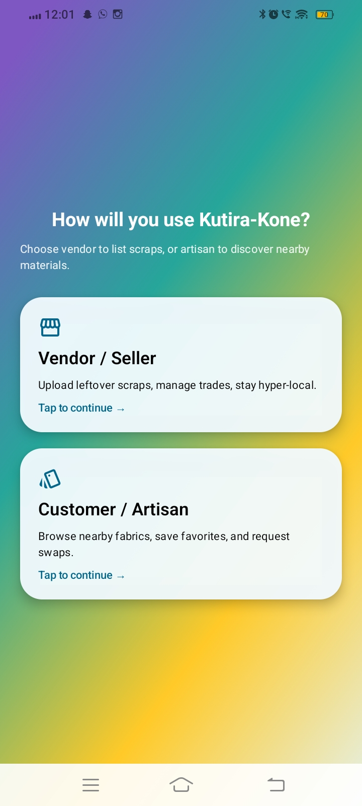 | 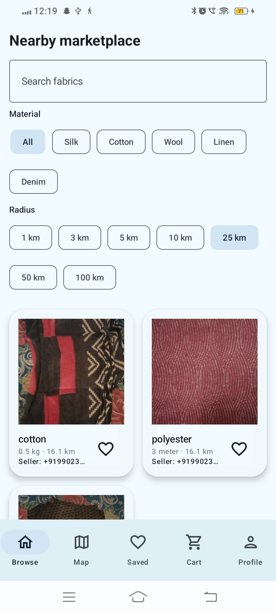 |

| Fabric Details | Wishlist |
|---|---|
| 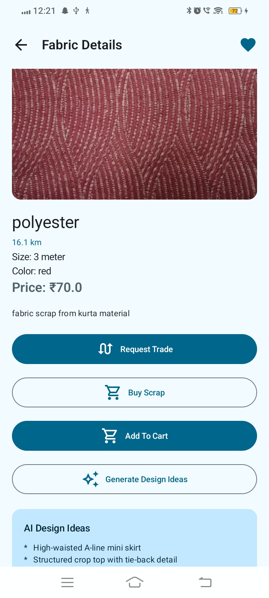 | 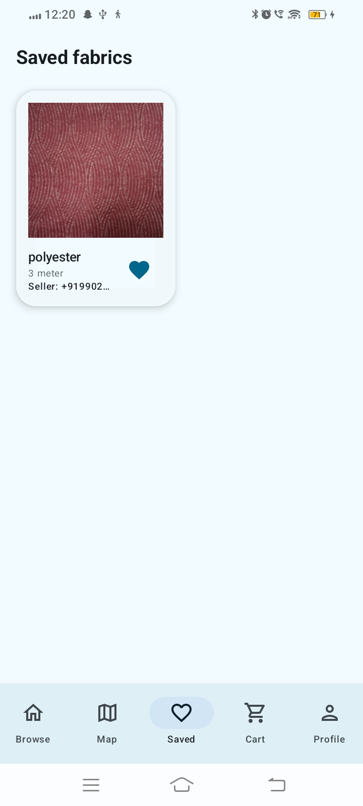 |

| Checkout | Razorpay Payment |
|---|---|
| 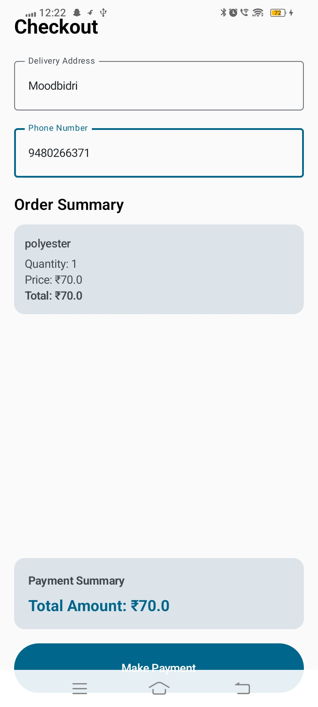 | 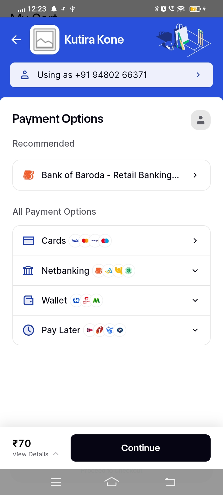 |

| Payment Result | Customer Orders |
|---|---|
| 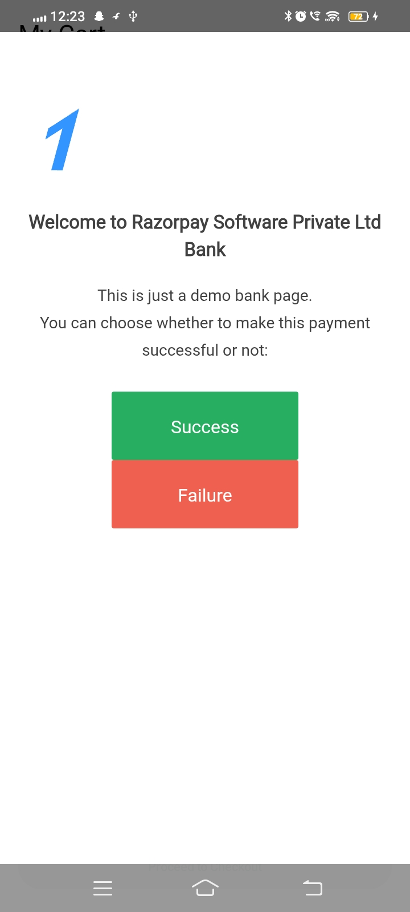 | 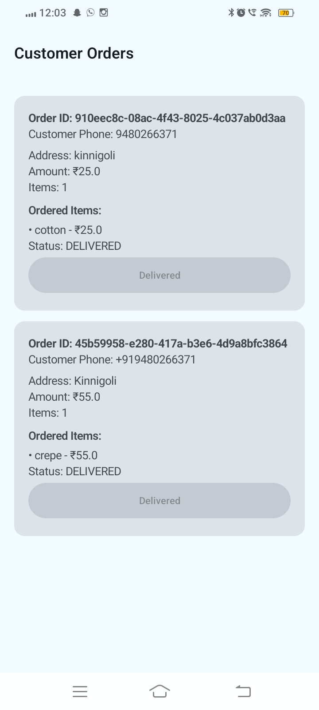 |

| My Orders | Customer Profile |
|---|---|
| 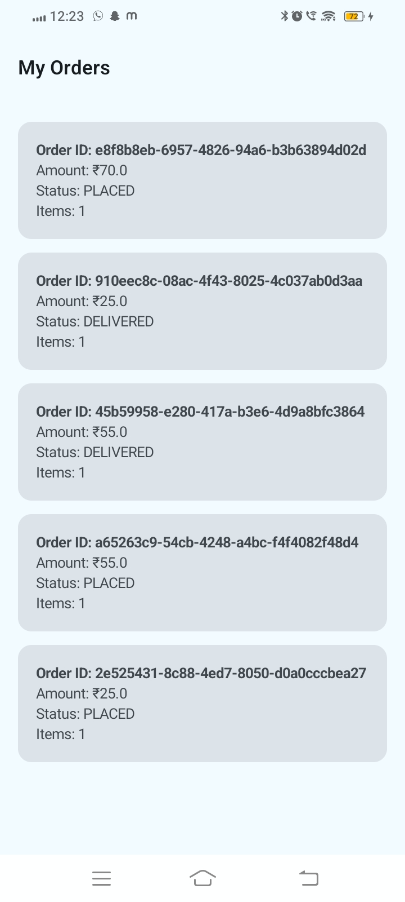 | 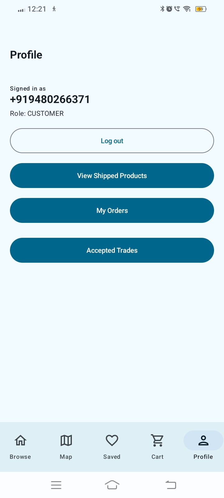 |

| Vendor Profile | Trade Requests |
|---|---|
| 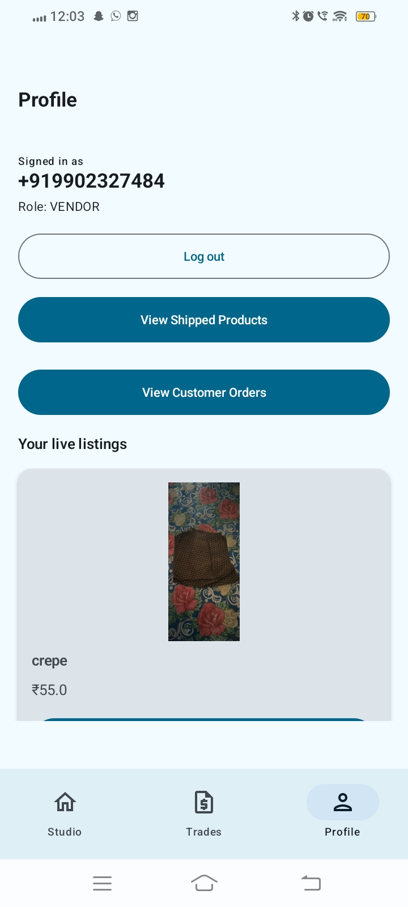 | 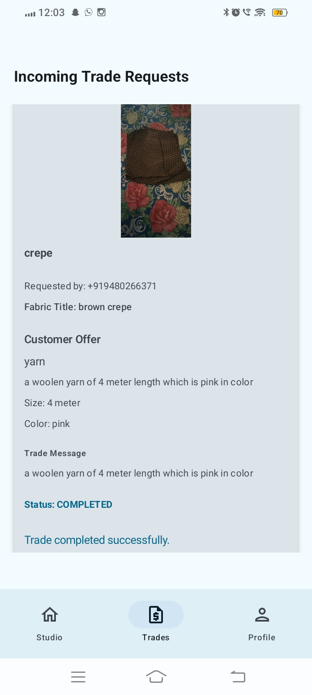 |

| Shipped Products |
|---|
| 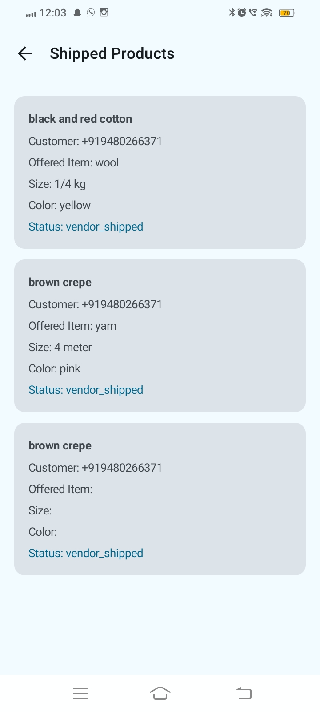 |
